## Overview
In this project, we go through the various tasks and steps to operationalize Machine Learning in Azure. The steps involved are:

1. Authentication
2. Defining your Machine Learning Model
3. Defining your Compute Infrastructure
3. Deploying the Model
4. Logging and enabling application insights for better troubleshooting
5. Consuming Model Endpoints
6. Creating pipeline to automate the whole process


## Architectural Diagram

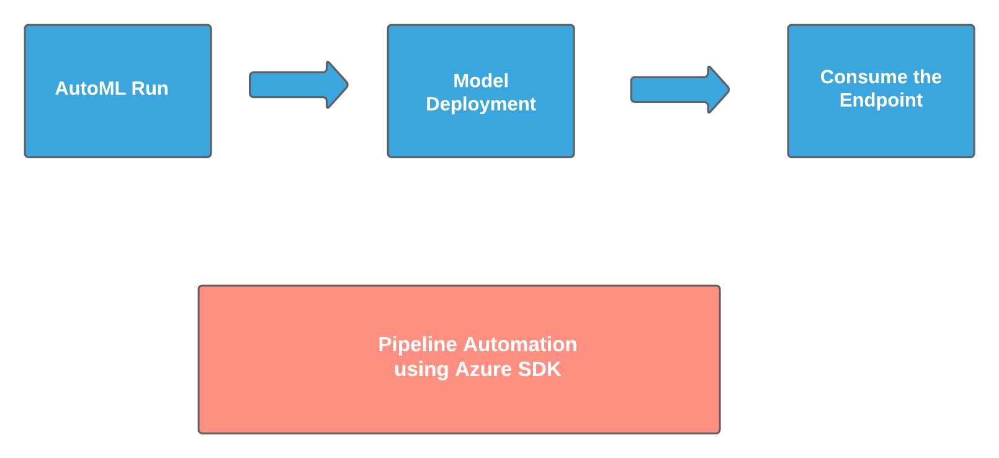

- **Automated ML Run**
    - Define the Run
    - Deploy the best model of the run
    - Consume the endpoint of the deployed model

- **Pipeline Automation using SDK**
    - We discuss the pipeline automation using Azure SDK


## How to improve the project in the future

In the project, we show how to create a service principal and assign a role to it independently. We can create a use case of using service principal in the process of pipeline automation.

In the future, we can demostrate the use of Parallel Run Step in the pipeline.


## Tasks/Topics Covered:


### Authentication

In this task, we create a service principal **ml-auth** and give the service princpal the role of owner:

- Ensure az is installed in the system, use az login to login to azure
```
az login
```
- Make sure az extension:  **azure-cli-ml** for machine learning is installed
```
az extension add -n azure-cli-ml

```
- Create a service principal with the name of **ml-auth**
```
az ad sp create-for-rbac --sdk-auth --name ml-auth

```
- Get the object Id of the service principal from the client-id of the service principal using the below command
```
az ad sp show --id xxxxxxxx-aea4-401c-a66e-xxxxxxxxxxxx
```
- Use the object Id from above to assign a role to the service principal, we are assigning the role of "owner" in the example below:
```
az ml workspace share -w azure-ml-nd-ws -g azure-ml-nd --user xxxxxxxx-5a2a-4309-bb06-xxxxxxxxxxxx --role owner
```


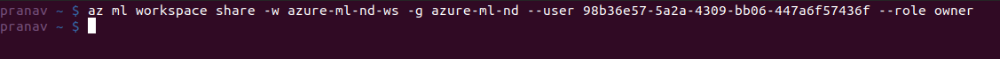


### AutoML Experiment

In this task, we create a new Automated ML run: Steps involved are as below:

- Select the dataset available(we have Bank-marketing dataset from the previous project) or create a new dataset.
- Select the compute cluster or create a new cluster
- Use an existing experiment or create a new experiment
- Choose the Target column, we use the column 'y' for our run
- Select the task type, in our case it is classification.

Dataset Used:

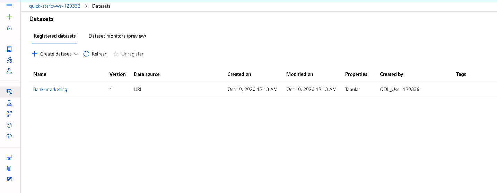

Experiment Run:

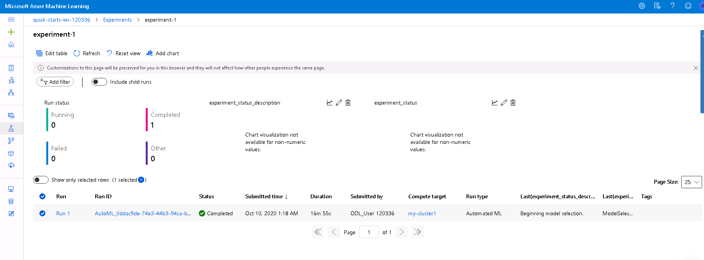

Best Model of the run: VotingEnsemble

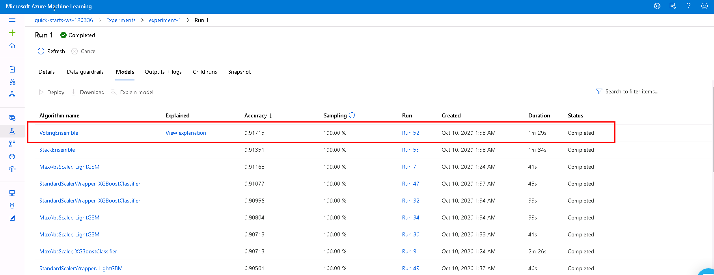


### Deploying the Model

Follow the following steps to deploy the model:

- Choose the best model from the **Models** tab of the experiment. The best model will be at the top of all the models.
- Click "Deploy" to deploy the model.
- Name the deployment, and choose the compute type. We have used the compute type as Azure Container Service and enabled authentication.

Deployment can be visible in Endpoints:

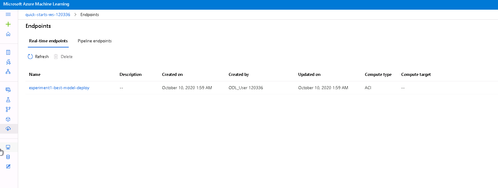

### Logging and enabling application insights

Follow the following steps to see logs for the endpoint and to enable application insights:

- Download the config.json from the azure workspace
- Update the logs.py file with the name of the deployement, and update the attribute **enable_app_insights = True** for the Webservice.
- Run logs.py to see the logs 
```
python logs.py

```


Logs:

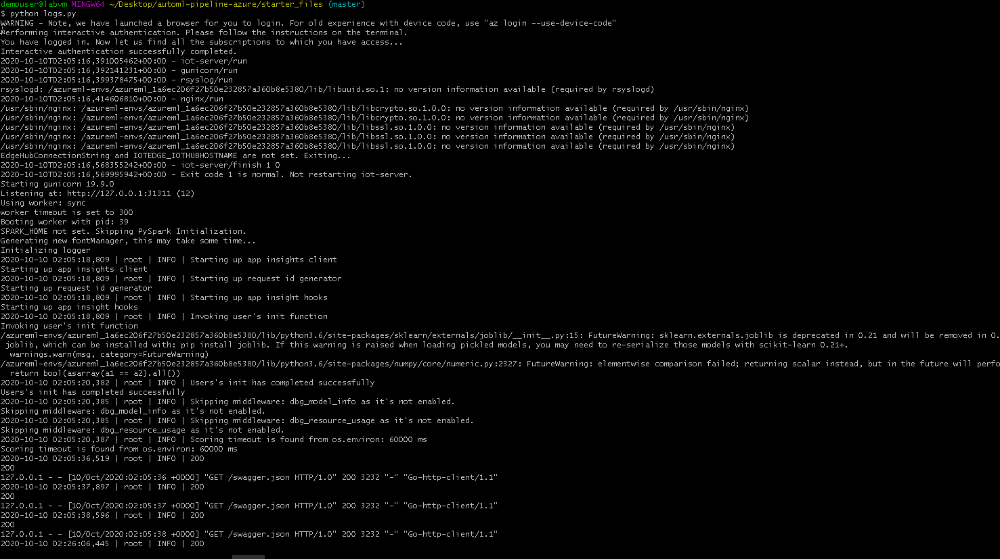

Application Insights enabled:

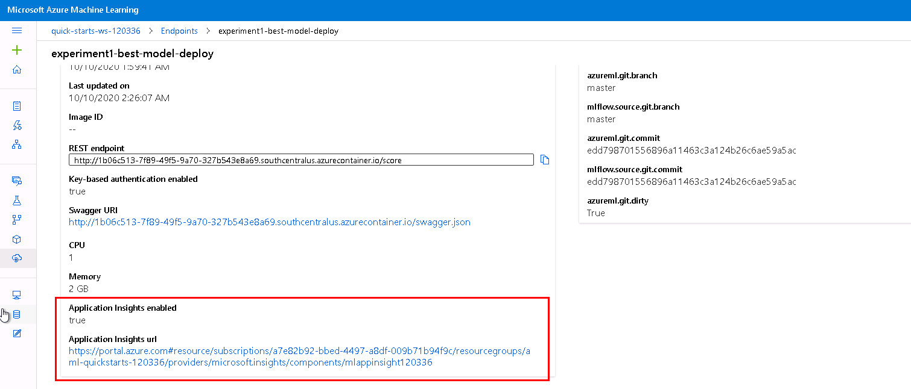

### Swagger Documentation

In this task, we show the documentation of the HTTP API of the model via swagger. Follow the below steps:

- Download the swagger.json file from the endpoint
- Run swagger.sh script to run the SwaggerUI using Docker.( Update the port for Swagger UI if port 80 is not available)
```
bash swagger.sh
```
- Run serve.py to enable the current folder as the web server.
```
python serve

```


Swagger Documention of the HTTP API:

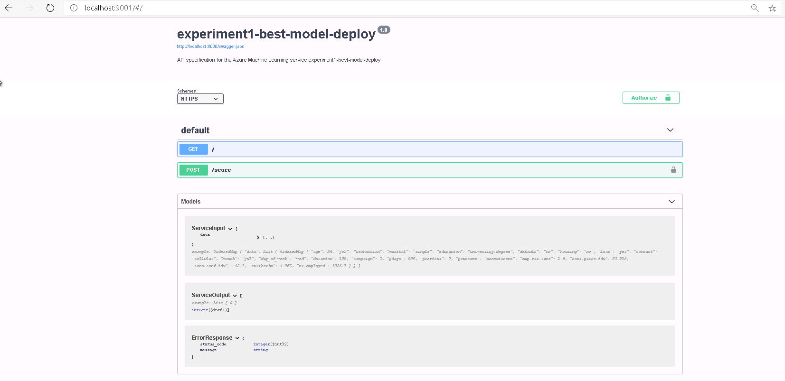


### Consuming and Benchmarking the Model Endpoints

In this task, we are going to consume and benchmark the endpoint:

- Choose the endpoint and click on **Consume** tab of the endpoint page
- Note the REST endpoint and primary or the secondary key to interact with it
- Update the endpoint.py file with the scoring_uri and key value from above
- Run endpoint.py

```
python endpoint.py
```
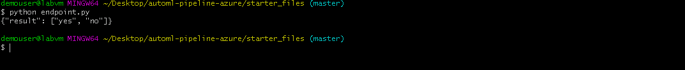
- We benchmark the endpoint using Apache Benchmark(make sure you have the Apache Benchmark CLI installed). 
- Update the benchmark.py file with the REST endpoint and key
- Run benchmark.sh

```
bash benchmark.sh
```
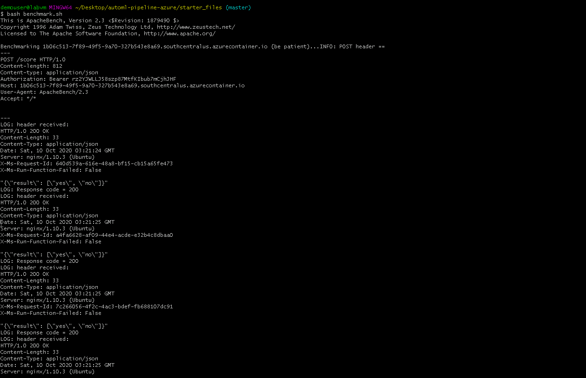
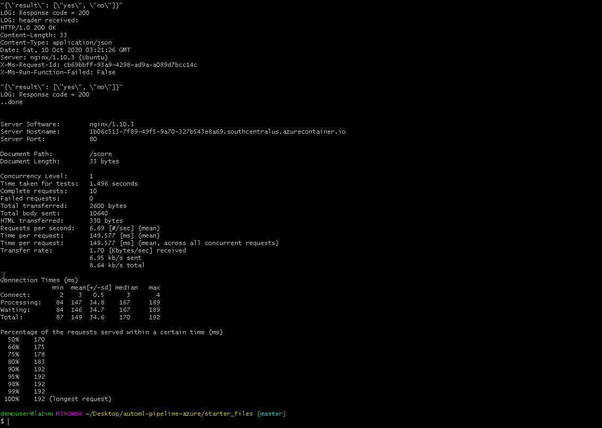

### Create, Publish and Consume a Pipeline

Here we create, publish and consume a pipeline using Azure SDK

- Update the notebook: **aml-pipelines-with-automated-machine-learning-step.ipynb** with the experiments, compute target, datasets of your workspace
- Run all the cells in the notebook

Pipeline Created:

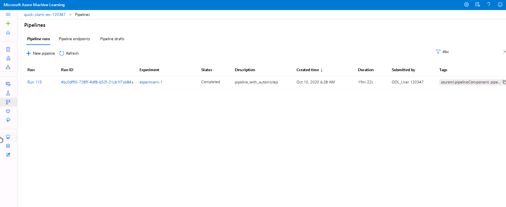

Pipeline Endpoint Created:

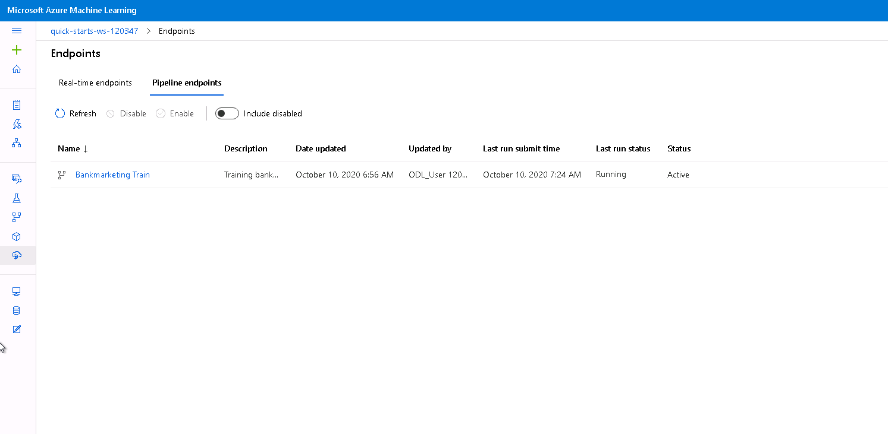

Pipeline Graph:

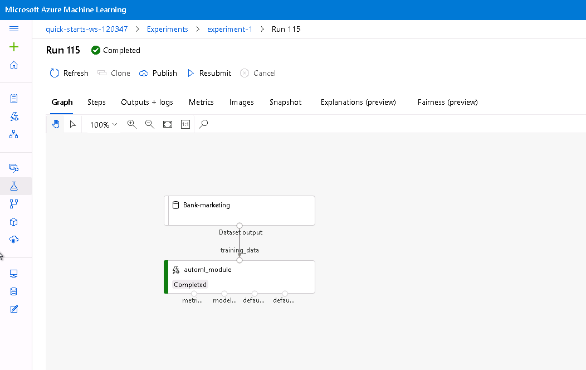

Published Pipleline Overview:

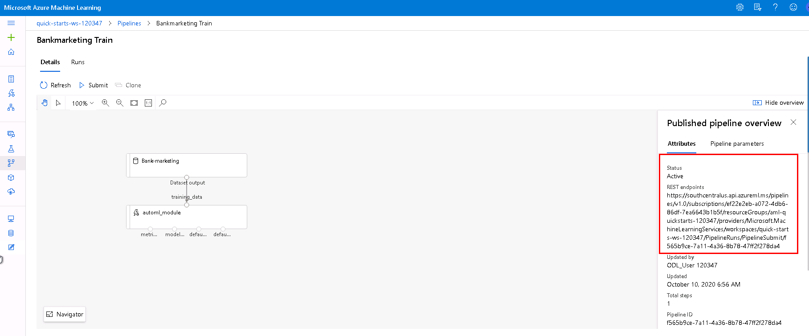

RunDetails Widget:

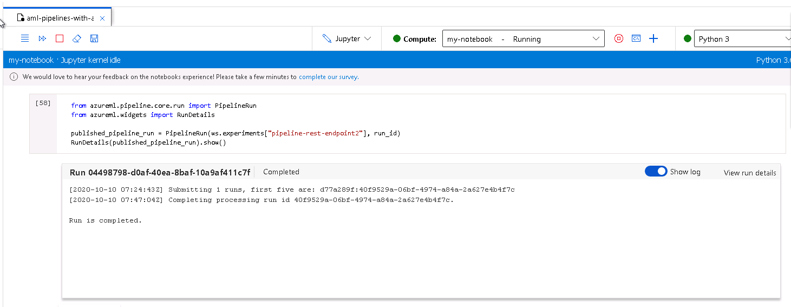

Pipeline Rest Endpoint Run:

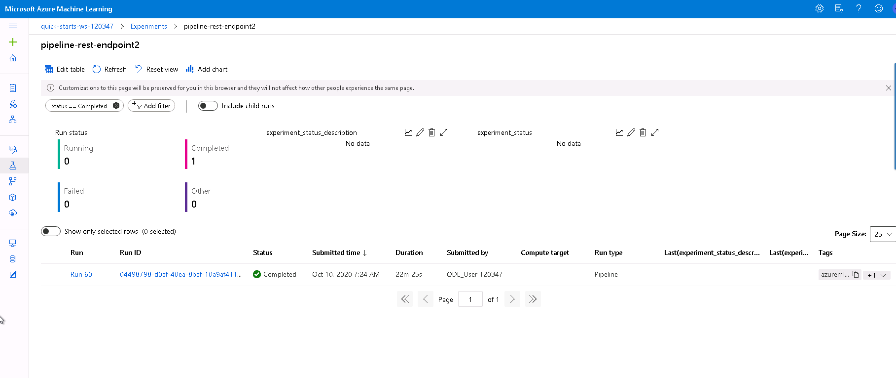

## Screen Recording

Please follow the link for the screen cast: [Operationalizing Azure ML](https://youtu.be/6xIria_vp6E){:target="_blank"}


